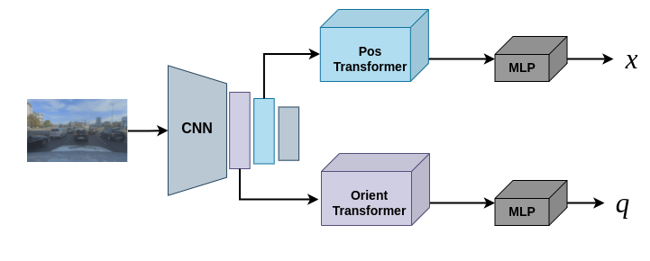

## Employing Transformer-based Pose Regression to establish the initial localization state with enhanced accuracy and efficiency




### Repository Overview 

This code implements:

Training of a Transformer-based architecture for absolute ego pose regression used for enhancing the initial pose required for localization algorithms. 

---

### Prerequisites

In order to run this repository you will need:

1. Python3 (tested with Python 3.7.7, 3.8.5), PyTorch
2. Set up the conda environment with ```conda env create -f environment.yml```
3. Benchmarking on various datasets
3. Download the [DeepLoc dataset](http://deeploc.cs.uni-freiburg.de/)
4. Download the Oxford Robot Car dataset [Oxford Robot Car](https://robotcar-dataset.robots.ox.ac.uk/) 
5. We use the [RobustLoc](https://github.com/sijieaaa/RobustLoc) project that provides the Oxford RobotCar dataset that has been [pre-processed](https://github.com/sijieaaa/RobustLoc) 

### Data Preparation
 ```
📦data
  ┣ 📦DeepLoc
    ┣ 📂train
    ┃ ┣ 📂LeftImages
    ┃ ┣ 📂labels
    ┃ ┣ 📂labels_colorized
    ┃ ┣ 📜poses.txt
    ┣ 📂test
    ┃ ┣ 📂LeftImages
    ┃ ┣ 📂labels
    ┃ ┣ 📂labels_colorized
    ┃ ┣ 📜poses.txt
    ┣ 📜pose_meta.txt
  
  📦RobotCar
    ┣ 📂loop
    ┃ ┣ 📂2014-06-23-15-36-04
    ┃ ┣ 📂2014-06-23-15-41-25
    ┃ ┣ 📂2014-06-26-08-53-56
    ┃ ┣ 📂2014-06-26-09-24-58
  📦RobotCar_poses
 ```

### Checkpoints 
TBD

### Usage

  For detailed explanation of the options run:)
  ```
  python main.py -h
  ```
  For example, in order to train the model on the DeepLoc or Oxford RobotCar datasets  run: 
  ```
python main.py --model_name apr-transformer --mode train --config_file config/RobotCar_config_aprtransformer.json --experiment {EXP_NAME} --entity {WANDB_USERNAME}
  ```

  ```
python main.py --model_name apr-transformer --mode train --config_file config/DeepLoc_config_aprtransformer.json   --experiment {EXP_NAME} --entity {WANDB_USERNAME}
  ```  
  Your checkpoints (.pth file saved based on the number you specify in the configuration file) and log file
  will be saved under an 'out' folder.

  **You will need a wandb account for logging the training metrics. Please pass your wandb username for the 'entity' flag**
  
  
  In order to test your model:
  ```
  python main.py --model_name apr-transformer --mode test --config_file config/DeepLoc_config_aprtransformer.json --checkpoint_path <path to your checkpoint .pth> --experiment {EXP_NAME} --entity {WANDB_USERNAME}
  ```

  
  
### Results

Prediction results on the DeepLoc dataset:

  

Prediction results on the Oxford RobotCar dataset:
  

### References

1. [DeepLoc](http://deeploc.cs.uni-freiburg.de/)
2. [Oxford Robot Car](https://robotcar-dataset.robots.ox.ac.uk/)
3. [RobustLoc: Robust Visual Localization in Changing Conditions](https://github.com/sijieaaa/RobustLoc)
4. [MS-Transformer: Learning Multi-Scene Camera Pose Regression with Transformers](https://github.com/yolish/multi-scene-pose-transformer)