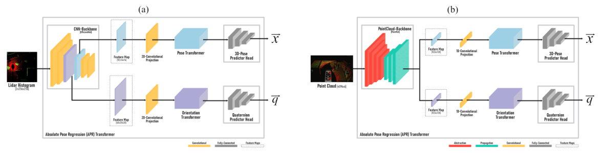

## Employing Transformer-based Pose Regression to establish the initial localization state with enhanced accuracy and efficiency

### Image input Architecture


### LiDAR input Architecture

 
### Repository Overview 

This code implements:

Training a Transformer-based architecture for absolute ego pose regression enhances the initial pose required for localization algorithms. This work was submitted to the [Autoware Challenge 2023](https://autoware.org/autoware-challenge-2023/) and is part of the research project [BeIntelli](https://be-intelli.com/) at TU-Berlin, Germany.  

[Presentation slides](https://docs.google.com/presentation/d/1vFl92lTybFowQvPHCWioYIUxFiz-KnqajVDfiVc4UJg/edit?usp=sharing)

---
### Results

Prediction results on the DeepLoc dataset:

  

Prediction results on the Oxford RobotCar dataset:

  

  
### Prerequisites

To run this repository, you will need:

1. Python3 (tested with Python 3.7.7, 3.8.5), PyTorch
2. Set up the conda environment with ```conda env create -f environment.yml```
3. Benchmarking on various datasets
3. Download the [DeepLoc dataset](http://deeploc.cs.uni-freiburg.de/)
4. Download the Oxford Robot Car dataset [Oxford Robot Car](https://robotcar-dataset.robots.ox.ac.uk/) 
5. We use the [RobustLoc](https://github.com/sijieaaa/RobustLoc) project that provides the Oxford RobotCar dataset that has been [pre-processed](https://github.com/sijieaaa/RobustLoc) 

### Data Preparation
 ```
📦data
  ┣ 📦DeepLoc
    ┣ 📂train
    ┃ ┣ 📂LeftImages
    ┃ ┣ 📂labels
    ┃ ┣ 📂labels_colorized
    ┃ ┣ 📜poses.txt
    ┣ 📂test
    ┃ ┣ 📂LeftImages
    ┃ ┣ 📂labels
    ┃ ┣ 📂labels_colorized
    ┃ ┣ 📜poses.txt
    ┣ 📜pose_meta.txt
  
  📦RobotCar
    ┣ 📂loop
    ┃ ┣ 📂2014-06-23-15-36-04
    ┃ ┣ 📂2014-06-23-15-41-25
    ┃ ┣ 📂2014-06-26-08-53-56
    ┃ ┣ 📂2014-06-26-09-24-58
  📦RobotCar_poses
 ```

### Model Checkpoints 

| Dataset        | Position Error | Orientation Error          | Download  | Logs |  
| :-------------: |:-------------:| :-----:| :-----:| :-----:|
| DeepLoc     |0.81 m  |3.35 deg  | [model](https://tubcloud.tu-berlin.de/s/7JnSqyiY4YQzmkf)| [train](https://tubcloud.tu-berlin.de/s/Ldq4doj4aGwZ5qT), [test](https://tubcloud.tu-berlin.de/s/yMHHjsc2eXmZQEo)
| OxfordRobot Car |3.34 m  |1.04 deg | [model](https://tubcloud.tu-berlin.de/s/FnZmCNmnxpbzFj7)| [train](https://tubcloud.tu-berlin.de/s/xdrTQsTxYSbY72F), [test](https://tubcloud.tu-berlin.de/s/QQKonGJ5PYkDbo2)

### Usage

  For a detailed explanation of the options, run:
  ```
  python main.py -h
  ```
  For example, to train the model on the DeepLoc or Oxford RobotCar datasets,  run: 
  ```
python main.py --model_name apr-transformer --mode train --config_file config/RobotCar_config_aprtransformer.json --experiment {EXP_NAME} --entity {WANDB_USERNAME}
  ```

  ```
python main.py --model_name apr-transformer --mode train --config_file config/DeepLoc_config_aprtransformer.json   --experiment {EXP_NAME} --entity {WANDB_USERNAME}
  ```  
  Your checkpoints (.pth file saved based on the number you specify in the configuration file) and log file
  will be saved under an 'out' folder.

  **You will need a wandb account to log the training metrics. Please pass your wandb username for the 'entity' flag**
  
  
  To test your model:
  ```
  python main.py --model_name apr-transformer --mode test --config_file config/DeepLoc_config_aprtransformer.json --checkpoint_path <path to your checkpoint .pth> --experiment {EXP_NAME} --entity {WANDB_USERNAME}
  ```

### Upcoming Additions to the Repository
Following the publication of our work, we will be incorporating the extensive APR-BeIntelli dataset, which includes multi-camera images with corresponding pose labels and semantic masks. Furthermore, the repository will include checkpoints to the APR-Seg-Transformer model, reinforcing its utility for pose regression and semantic segmentation tasks. 

**TODO**
 Add integration code into Autoware.universe setup
 
### Code References

1. [DeepLoc](http://deeploc.cs.uni-freiburg.de/)
2. [Oxford Robot Car](https://robotcar-dataset.robots.ox.ac.uk/)
3. [RobustLoc: Robust Visual Localization in Changing Conditions](https://github.com/sijieaaa/RobustLoc)
4. [MS-Transformer: Learning Multi-Scene Camera Pose Regression with Transformers](https://github.com/yolish/multi-scene-pose-transformer)
